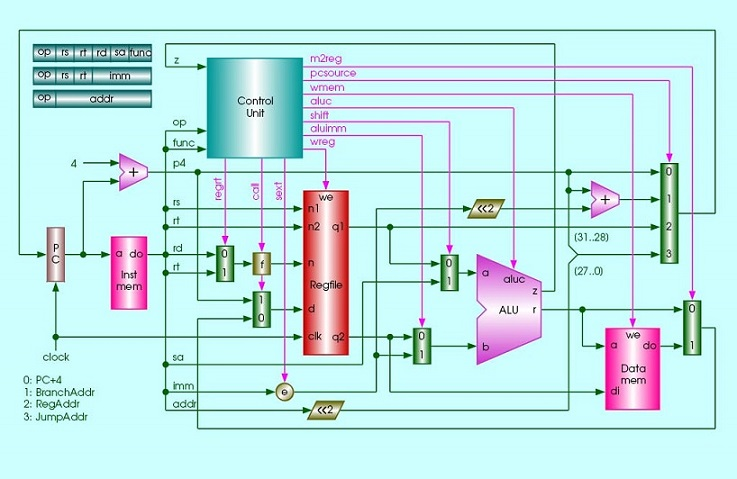
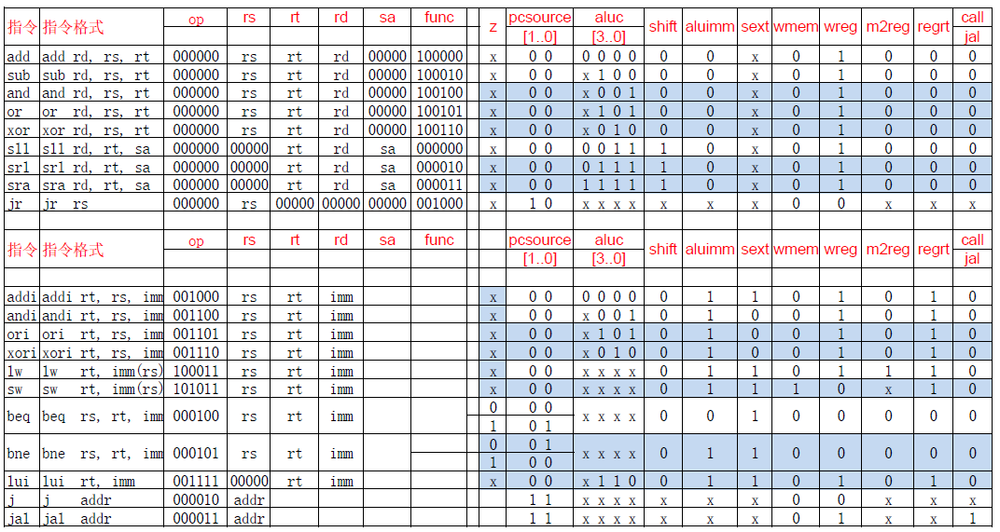
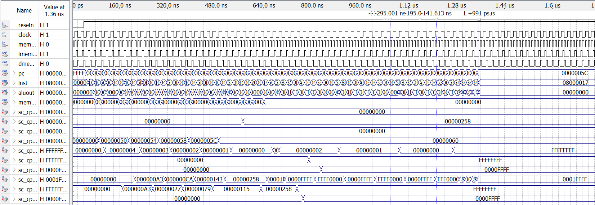

# Lab 1 基本单周期CPU设计 实验报告
EI332 计算机组成 SJTU, 2020 Spring  
  
**\[Notice] 评语: beq、bne指令执行时候alu应该对两个输入值进行相减操作，因此真值表里这两行的aluc不应该为xxxx**  
提供的基础模板中 `beq, bne` 的 `aluc` 已用 `xxxx` 填充，巨坑！  
项目中的代码已做对应修改，但其他场景未对应更新  

**目录**
<!-- MarkdownTOC -->

- [实验目的](#%E5%AE%9E%E9%AA%8C%E7%9B%AE%E7%9A%84)
- [设计方法与实验过程](#%E8%AE%BE%E8%AE%A1%E6%96%B9%E6%B3%95%E4%B8%8E%E5%AE%9E%E9%AA%8C%E8%BF%87%E7%A8%8B)
    - [设计基础：单周期 CPU 整体框架](#%E8%AE%BE%E8%AE%A1%E5%9F%BA%E7%A1%80%EF%BC%9A%E5%8D%95%E5%91%A8%E6%9C%9F-cpu-%E6%95%B4%E4%BD%93%E6%A1%86%E6%9E%B6)
    - [控制信号真值表设计](#%E6%8E%A7%E5%88%B6%E4%BF%A1%E5%8F%B7%E7%9C%9F%E5%80%BC%E8%A1%A8%E8%AE%BE%E8%AE%A1)
    - [ALU 设计](#alu-%E8%AE%BE%E8%AE%A1)
    - [CU 设计](#cu-%E8%AE%BE%E8%AE%A1)
- [设计功能验证](#%E8%AE%BE%E8%AE%A1%E5%8A%9F%E8%83%BD%E9%AA%8C%E8%AF%81)
- [实验总结](#%E5%AE%9E%E9%AA%8C%E6%80%BB%E7%BB%93)

<!-- /MarkdownTOC -->


<a id="%E5%AE%9E%E9%AA%8C%E7%9B%AE%E7%9A%84"></a>
##实验目的
1. 在提供的代码的基础上，采用 `Verilog` 硬件描述语言 在 `Quartus II EDA` 设计平台中 ，基于 `Intel cyclone II` 系列 FPGA 实现 具有执行 20 条 MIPS 基本指令的单周期 CPU 模块设计。
2. 利用实验提供的标准测试程序代码， 完成单周期 CPU 模块的 功能仿真测试，验证 CPU 执行所设计的 20 条指令功能的正确性。
3. 理解计算机五大组成部分的协调工作原理，理解存储程序自动执行的原理和掌握运算器、存储器、控制器的设计和实现原理。


<a id="%E8%AE%BE%E8%AE%A1%E6%96%B9%E6%B3%95%E4%B8%8E%E5%AE%9E%E9%AA%8C%E8%BF%87%E7%A8%8B"></a>
## 设计方法与实验过程

<a id="%E8%AE%BE%E8%AE%A1%E5%9F%BA%E7%A1%80%EF%BC%9A%E5%8D%95%E5%91%A8%E6%9C%9F-cpu-%E6%95%B4%E4%BD%93%E6%A1%86%E6%9E%B6"></a>
### 设计基础：单周期 CPU 整体框架
根据方向忠老师的授课材料，典型的单周期 CPU 具有如下整体结构：  
<div align="center"></div>

<a id="%E6%8E%A7%E5%88%B6%E4%BF%A1%E5%8F%B7%E7%9C%9F%E5%80%BC%E8%A1%A8%E8%AE%BE%E8%AE%A1"></a>
### 控制信号真值表设计
根据单周期 CPU 的整体结构，我们可以了解各指令在执行过程中，控制信号的真值或不影响等情况，并填写下表：
<dir align="center"></dir>
由此，结合对顶层文件 `sc_computer.v` 等设计文件的理解，我们可以完成对 `alu.v`, `sc_cu.v` 相关部分的补充。

<a id="alu-%E8%AE%BE%E8%AE%A1"></a>
### ALU 设计
ALU 根据 `aluc` 信号执行对应的操作，相关代码（含已给）如下：  
```Verilog
module alu (a,b,aluc,s,z);
    input  [31:0]  a, b;
    input  [3:0]   aluc;
    output [31:0]  s;
    output         z;

    reg    [31:0]  s;
    reg            z;

    always @ (a or b or aluc) 
        begin                                    // event
            casex (aluc)
                4'bx000: s = a + b;              //x000 ADD
                // ** FILLED IN - START **
                4'bx100: s = a - b;              //x100 SUB
                4'bx001: s = a & b;              //x001 AND
                4'bx101: s = a | b;              //x101 OR
                4'bx010: s = a ^ b;              //x010 XOR
                4'bx110: s = b << 16;            //x110 LUI: imm << 16bit             
                4'b0011: s = b << a;             //0011 SLL: rd <- (rt << sa)
                4'b0111: s = b >> a;             //0111 SRL: rd <- (rt >> sa) (logical)
                // ** FILLED IN - END **
                4'b1111: s = $signed(b) >>> a;   //1111 SRA: rd <- (rt >> sa) (arithmetic)
                default: s = 0;
            endcase
            if (s == 0)  z = 1;
            else z = 0;
        end      
endmodule 
```

<a id="cu-%E8%AE%BE%E8%AE%A1"></a>
### CU 设计
CU 主要根据 `op, func` 等信号，“编译”指令的操作，并生成相应的控制信号，控制 `Register, ALU, Data Memory` 等模块工作。根据建立的真值表，我们不难对代码进行如下补充：  
```Verilog
    wire i_and = r_type &  func[5]  & ~func[4] & ~func[3] &  func[2]  & ~func[1] & ~func[0];   // 100100
    wire i_or  = r_type &  func[5]  & ~func[4] & ~func[3] &  func[2]  & ~func[1] &  func[0];   // 100101
    wire i_xor = r_type &  func[5]  & ~func[4] & ~func[3] &  func[2]  &  func[1] & ~func[0];   // 100110
    wire i_sll = r_type & ~func[5]  & ~func[4] & ~func[3] & ~func[2]  & ~func[1] & ~func[0];   // 000000
    wire i_srl = r_type & ~func[5]  & ~func[4] & ~func[3] & ~func[2]  &  func[1] & ~func[0];   // 000010
    wire i_sra = r_type & ~func[5]  & ~func[4] & ~func[3] & ~func[2]  &  func[1] &  func[0];   // 000011
    wire i_jr  = r_type & ~func[5]  & ~func[4] &  func[3] & ~func[2]  & ~func[1] & ~func[0];   // 001000

    wire i_ori  = ~op[5] & ~op[4] &  op[3] &  op[2] & ~op[1] &  op[0]; //001101
    wire i_xori = ~op[5] & ~op[4] &  op[3] &  op[2] &  op[1] &  op[0]; //001110
    wire i_lw   =  op[5] & ~op[4] & ~op[3] & ~op[2] &  op[1] &  op[0]; //100011
    wire i_sw   =  op[5] & ~op[4] &  op[3] & ~op[2] &  op[1] &  op[0]; //101011
    wire i_beq  = ~op[5] & ~op[4] & ~op[3] &  op[2] & ~op[1] & ~op[0]; //000100
    wire i_bne  = ~op[5] & ~op[4] & ~op[3] &  op[2] & ~op[1] &  op[0]; //000101
    wire i_lui  = ~op[5] & ~op[4] &  op[3] &  op[2] &  op[1] &  op[0]; //001111
    wire i_j    = ~op[5] & ~op[4] & ~op[3] & ~op[2] &  op[1] & ~op[0]; //000010
    wire i_jal  = ~op[5] & ~op[4] & ~op[3] & ~op[2] &  op[1] &  op[0]; //000011

    assign aluc[3] = i_sra;
    assign aluc[2] = i_sub | i_or  | i_srl | i_sra | i_ori | i_lui ;
    assign aluc[1] = i_xor | i_sll | i_srl | i_sra | i_xori | i_lui;
    assign aluc[0] = i_and | i_or  | i_sll | i_srl | i_sra | i_andi | i_ori;

    assign aluimm  = i_addi| i_andi| i_ori | i_xori| i_lw  | i_sw  | i_lui;
    assign sext    = i_addi| i_lw  | i_sw  | i_beq | i_bne | i_lui;
    assign wmem    = i_sw;
    assign m2reg   = i_lw;
    assign regrt   = i_addi| i_andi| i_ori | i_xori| i_lw  | i_sw  | i_lui;
    assign jal     = i_jal;
```

<a id="%E8%AE%BE%E8%AE%A1%E5%8A%9F%E8%83%BD%E9%AA%8C%E8%AF%81"></a>
## 设计功能验证
根据测试输入波形，通过波形模拟仿真，得到如下结果，与设计目标功能基本吻合。
<div align="center"></div>
上图中可以观察到，程序执行到最后，停在最后一条死循环跳转指令处，`inst = 08000017`，`pc = 0000005c`。
接着，以 `200ns` 为“分辨率”，我们可以进一步细致观察仿真结果：
<div align="center"></div>
<div align="center"></div>
<div align="center"></div>
<div align="center"></div>
<div align="center"></div>
<div align="center"></div>
<div align="center"></div>

<a id="%E5%AE%9E%E9%AA%8C%E6%80%BB%E7%BB%93"></a>
## 实验总结
总的来说，本次实验基本实现了实验相关要求，达到了实验目的。  

在此过程中，依据理论学习讲授的知识，结合参考代码，通过 `Verilog` 硬件描述语言等，在某种程度上来说，实验的过程达到了“学以致用”、“理论实际相结合”的目的。  

当然，也需要注意到，虽然大部分代码已经提供，但在实际操作过程中，我在正确填写真值表（实验的基础）、软件操作、代码规范等等方面遇到了不小的困难，也在解决这些挑战的过程中收获了提高。