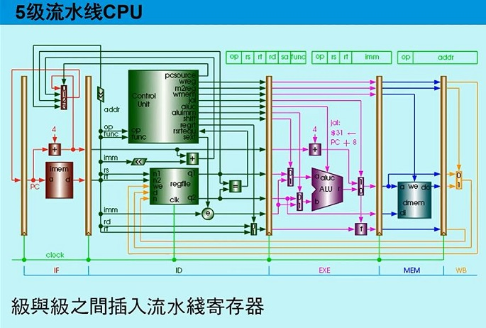

# Lab 3 五级流水 CPU 模块设计仿真 实验报告
EI332 计算机组成 SJTU, 2020 Spring  
  

<br>

## 目录
<!-- MarkdownTOC -->

- [实验目的](#%E5%AE%9E%E9%AA%8C%E7%9B%AE%E7%9A%84)
- [实验要求](#%E5%AE%9E%E9%AA%8C%E8%A6%81%E6%B1%82)
- [流水线设计思路](#%E6%B5%81%E6%B0%B4%E7%BA%BF%E8%AE%BE%E8%AE%A1%E6%80%9D%E8%B7%AF)
    - [IF 阶段流水段输入\(`pipepc`\)](#if-%E9%98%B6%E6%AE%B5%E6%B5%81%E6%B0%B4%E6%AE%B5%E8%BE%93%E5%85%A5pipepc)
    - [IF 阶段取指令\(`pipeif`\)](#if-%E9%98%B6%E6%AE%B5%E5%8F%96%E6%8C%87%E4%BB%A4pipeif)
    - [IF/ID 流水线寄存器\(`pipeir`\)](#ifid-%E6%B5%81%E6%B0%B4%E7%BA%BF%E5%AF%84%E5%AD%98%E5%99%A8pipeir)
    - [ID 阶段译码指令\(`pipeid`\)](#id-%E9%98%B6%E6%AE%B5%E8%AF%91%E7%A0%81%E6%8C%87%E4%BB%A4pipeid)
    - [ID/EXE 流水线寄存器\(`pipedereg`\)](#idexe-%E6%B5%81%E6%B0%B4%E7%BA%BF%E5%AF%84%E5%AD%98%E5%99%A8pipedereg)
    - [EXE 阶段运算（`pipeexe`)](#exe-%E9%98%B6%E6%AE%B5%E8%BF%90%E7%AE%97%EF%BC%88pipeexe)
    - [EXE/MEM 流水线寄存器\(`pipeemreg`\)](#exemem-%E6%B5%81%E6%B0%B4%E7%BA%BF%E5%AF%84%E5%AD%98%E5%99%A8pipeemreg)
    - [MEM 数据存取\(`pipemem`\)](#mem-%E6%95%B0%E6%8D%AE%E5%AD%98%E5%8F%96pipemem)
    - [MEM/WB 流水线寄存器\(`pipemwreg`\)](#memwb-%E6%B5%81%E6%B0%B4%E7%BA%BF%E5%AF%84%E5%AD%98%E5%99%A8pipemwreg)
- [波形仿真结果验证](#%E6%B3%A2%E5%BD%A2%E4%BB%BF%E7%9C%9F%E7%BB%93%E6%9E%9C%E9%AA%8C%E8%AF%81)
    - [五级流水线 CPU 功能仿真](#%E4%BA%94%E7%BA%A7%E6%B5%81%E6%B0%B4%E7%BA%BF-cpu-%E5%8A%9F%E8%83%BD%E4%BB%BF%E7%9C%9F)
    - [五级流水线 CPU I/O 扩展功能仿真](#%E4%BA%94%E7%BA%A7%E6%B5%81%E6%B0%B4%E7%BA%BF-cpu-io-%E6%89%A9%E5%B1%95%E5%8A%9F%E8%83%BD%E4%BB%BF%E7%9C%9F)
- [实验总结](#%E5%AE%9E%E9%AA%8C%E6%80%BB%E7%BB%93)
- [附：代码实现](#%E9%99%84%EF%BC%9A%E4%BB%A3%E7%A0%81%E5%AE%9E%E7%8E%B0)
    - [顶层文件](#%E9%A1%B6%E5%B1%82%E6%96%87%E4%BB%B6)
    - [`pipepc` 模块](#pipepc-%E6%A8%A1%E5%9D%97)
    - [`pipeif` 模块](#pipeif-%E6%A8%A1%E5%9D%97)
    - [`pipeir` 模块](#pipeir-%E6%A8%A1%E5%9D%97)
    - [`pipeid` 模块](#pipeid-%E6%A8%A1%E5%9D%97)
    - [`pipedereg` 模块](#pipedereg-%E6%A8%A1%E5%9D%97)
    - [`pipeexe` 模块](#pipeexe-%E6%A8%A1%E5%9D%97)
    - [`pipeemreg` 模块](#pipeemreg-%E6%A8%A1%E5%9D%97)
    - [`pipemem` 模块](#pipemem-%E6%A8%A1%E5%9D%97)
    - [`pipemwreg` 模块](#pipemwreg-%E6%A8%A1%E5%9D%97)

<!-- /MarkdownTOC -->


<a id="%E5%AE%9E%E9%AA%8C%E7%9B%AE%E7%9A%84"></a>
## 实验目的
1. 理解计算机指令流水线的协调工作原理，初步掌握流水线的设计和实现原理。
2. 深刻理解流水线寄存器在流水线实现中所起的重要作用。
3. 理解和掌握流水段的划分、设计原理及其实现方法原理。
4. 掌握运算器、寄存器堆、存储器、控制器在流水工作方式下，有别于实验一的设计和实现方法。
5. 掌握流水方式下，通过 I/O 端口与外部设备进行信息交互的方法。


<a id="%E5%AE%9E%E9%AA%8C%E8%A6%81%E6%B1%82"></a>
## 实验要求
1. 完成五级流水线 CPU 核心模块的设计 。
2. 完成对五级流水线 CPU 的仿真，仿真测试程序应该具有与实验一提供的标准测试程序代码相同的功能。 对两种 CPU 实现核心处理功能的过程和设计处理上的区别作对比分析 。
3. 完成流水线 CPU 的 IO 模块仿真 ，对两种 CPU 实现相同 IO 功能的过程和设计处理上的区别作对比分析。


<br>


<a id=""></a>
<a id="%E6%B5%81%E6%B0%B4%E7%BA%BF%E8%AE%BE%E8%AE%A1%E6%80%9D%E8%B7%AF"></a>
## 流水线设计思路
流水线设计结构如下：  
<div align="center">
    
</div>
结合顶层文件的模块实例化，可以将流水线 CPU 对指令的处理，按照顺序按级逐个实现。


<br>

<a id="if-%E9%98%B6%E6%AE%B5%E6%B5%81%E6%B0%B4%E6%AE%B5%E8%BE%93%E5%85%A5pipepc"></a>
###  IF 阶段流水段输入(`pipepc`)
为能使 IF 段能获得正确的执行指令，需要在 `clock` 时钟信号上升沿触发更新 `pc` 的值，具体来说，有以下几种情况：

+ `resetn = LOW`，即重置 PC。考虑到取地址时的 `+4` 操作，这里将 `pc` 的值设为 `4`；
+ `resetn = HIGH, wpcir = LOW`，即上一条 `lw` 指令造成了数据冒险，需要插入气泡解决，不更新 `pc` 值；
+ `resetn = HIGH, wpcir = HIGH`，即无上一条 `lw` 指令造成的数据冒险，更新 `pc` 值；


<br>

<a id="if-%E9%98%B6%E6%AE%B5%E5%8F%96%E6%8C%87%E4%BB%A4pipeif"></a>
### IF 阶段取指令(`pipeif`)
主要流程为：从由 `mem_clock` 时钟信号控制的 ROM 中取指令，根据 `pcsource` 决定多选器输出的下一条指令的来源。其中：

+ `bpc` 是 `beq, bne` 跳转指令跳转至的下一条指令；
+ `da` 是寄存器的值，产生于 `jr` 指令的跳转
+ `jpc` 是指令值，产生于 `j, jal` 指令的跳转
+ ROM 控制时钟信号 `mem_clock` 是时钟信号 `clock` 的反向，从而使得 `pc` 有半个时钟周期的稳定时间


<br>

<a id="ifid-%E6%B5%81%E6%B0%B4%E7%BA%BF%E5%AF%84%E5%AD%98%E5%99%A8pipeir"></a>
### IF/ID 流水线寄存器(`pipeir`)
该流水线寄存器主要连接了 IF 和 ID 两个阶段，并传递系统运行需要的控制信号。其受 `clock` 控制（上升沿触发），与 IF 段输入 `pipepc` 相似，根据 `restn, wpcir` 的值判断操作：

+ `resetn = LOW`，即清零。重置输出端口 `inst, dpc4` 的值；
+ `resetn = HIGH, wpcir = LOW`，即上一条 `lw` 指令造成了数据冒险，插入了气泡，不更新输出值；
+ `resetn = HIGH, wpcir = HIGH`，即无上一条 `lw` 指令造成的数据冒险，更新输出端口值；


<br>

<a id="id-%E9%98%B6%E6%AE%B5%E8%AF%91%E7%A0%81%E6%8C%87%E4%BB%A4pipeid"></a>
### ID 阶段译码指令(`pipeid`)
其负责读写寄存器，并译码指令，根据指令生成相应的控制信号，故这是相对核心的部分，输入输出信号端口也较多。  
与此同时，一些流水线冒险的检测和处理也给该阶段增加了复杂性。  

+ **数据冒险**：主要是由上一条 `lw` 指令造成。
    * 若由上一条 `lw` 指令造成，则该冒险是否发生，可以通过检测当前指令的源、目标地址与上一条指令是否相同来判断，并由 `wpcir` 这一低有效信号体现。当这一冒险发生时，需要插入气泡，通过置零各控制信号来停顿流水线操作和指令的更新，这也是 `pipeir, pipepc` 中特殊情况的来源。
    * 否则，由其他指令造成的数据冒险，可以通过数据直通（旁路）解决，故，我们需要通过转发信号 `fwda, fwdb` 来帮助多选器判断数据的来源。
+ **控制冒险**：我们需要检测是否有因为指令跳转而造成的控制冒险。在几种解决方案中，这里使用相对简单的“冻结或冲刷流水线”的设计，即，置零跳转后一条指令的所有控制信号，以避免这一后一条指令的执行造成的错误。


<br>

<a id="idexe-%E6%B5%81%E6%B0%B4%E7%BA%BF%E5%AF%84%E5%AD%98%E5%99%A8pipedereg"></a>
### ID/EXE 流水线寄存器(`pipedereg`)
该流水线寄存器主要连接了 ID 和 EXE 两个阶段，并传递系统运行需要的控制信号。其受 `clock` 控制（上升沿触发），执行与 IF/ID 段流水线寄存器相似的 `restn` 置零输出、正常赋值输出功能。


<br>

<a id="exe-%E9%98%B6%E6%AE%B5%E8%BF%90%E7%AE%97%EF%BC%88pipeexe"></a>
### EXE 阶段运算（`pipeexe`)
其主要调用 `alu` 模块（与单周期 CPU 实现相同）进行算术运算，并将系统需要的控制指令向后传递。  
需要注意，回跳指令读取的地址应为 `pc + 4`。


<br>

<a id="exemem-%E6%B5%81%E6%B0%B4%E7%BA%BF%E5%AF%84%E5%AD%98%E5%99%A8pipeemreg"></a>
### EXE/MEM 流水线寄存器(`pipeemreg`)
该流水线寄存器主要连接了 EXE 和 MEM 两个阶段，并传递系统运行需要的控制信号。其受 `clock` 控制（上升沿触发），执行与前述段流水线寄存器相似的 `restn` 置零输出、正常赋值输出功能。


<br>

<a id="mem-%E6%95%B0%E6%8D%AE%E5%AD%98%E5%8F%96pipemem"></a>
### MEM 数据存取(`pipemem`)
主要流程为：对由 `ram_clk` 时钟信号控制的 RAM，通过 `sc_datamem`（与实验二基本相同）进行数据读写。 需要注意：

+ 考虑到 I/O 扩展的需求，故在实验二的基础上，新增了一个输出端口
+ RAM 控制时钟信号 `ram_clk` 是时钟信号 `clock` 的反向，从而使得有半个时钟周期的稳定时间


<br>

<a id="memwb-%E6%B5%81%E6%B0%B4%E7%BA%BF%E5%AF%84%E5%AD%98%E5%99%A8pipemwreg"></a>
### MEM/WB 流水线寄存器(`pipemwreg`)
该流水线寄存器主要连接了 MEM 和 WB 两个阶段，并传递系统运行需要的控制信号。其受 `clock` 控制（上升沿触发），执行与前述段流水线寄存器相似的 `restn` 置零输出、正常赋值输出功能。


<br><br>


<a id="%E6%B3%A2%E5%BD%A2%E4%BB%BF%E7%9C%9F%E7%BB%93%E6%9E%9C%E9%AA%8C%E8%AF%81"></a>
## 波形仿真结果验证
为工程结构简便起见，这里特别指定了流水线、流水线 I/O 扩展仿真各自需要的 `.mif` 文件名：

+ 五级流水线 CPU 功能仿真: `sc_datamem - pipeline.mif`, `sc_instmem - pipeline.mif`
+ 五级流水线 CPU I/O 扩展功能仿真: `sc_datamem - IO.mif`, `sc_instmem - IO.mif`

在实际仿真时，将相应文件名改为 `sc_datamem.mif`, `sc_instmem.mif` 即可。 

使用仿真波形文件 `.vwf` 分别为：

+ 五级流水线 CPU 功能仿真: `test_wave - pipeline.vwf`，即提供的原名为 `pipelined_computer_test_wave_01.vwf` 的波形`test_wave - pipeline.vwf`文件
+ 五级流水线 CPU I/O 扩展功能：`test_wave - IO.vwf`，即在提供的波形文件基础上，删去一些端口，并将 `in_port0, in_port1` 改为 `Hexadecimal` 类型，并使用 `Value - Count Value` 设置自增值获得

<br>

具体仿真结果波形图如下：

<br>


<a id="%E4%BA%94%E7%BA%A7%E6%B5%81%E6%B0%B4%E7%BA%BF-cpu-%E5%8A%9F%E8%83%BD%E4%BB%BF%E7%9C%9F"></a>
### 五级流水线 CPU 功能仿真
<div align="center">
      
      
      
      
    
</div>

<br>

<a id="%E4%BA%94%E7%BA%A7%E6%B5%81%E6%B0%B4%E7%BA%BF-cpu-io-%E6%89%A9%E5%B1%95%E5%8A%9F%E8%83%BD%E4%BB%BF%E7%9C%9F"></a>
### 五级流水线 CPU I/O 扩展功能仿真
<div align="center">
      
      
      
      
    
</div>


<br>


<a id="%E5%AE%9E%E9%AA%8C%E6%80%BB%E7%BB%93"></a>
## 实验总结
总的来说，本次实验基本实现了实验相关要求，达到了实验目的。  

在此过程中，依据理论学习讲授的知识，结合参考代码，通过 `Verilog` 硬件描述语言等，在某种程度上来说，实验的过程达到了“学以致用”、“理论实际相结合”的目的。  

当然，也需要注意到，这次实验上手的的难度十分大，相关指导、介绍仍很少，基础代码变量数量多、变量名不直观，且 DEBUG 途径十分有限（报错信息、波形模拟），因此在实际操作过程中，对相关知识进行多方查找、参考便，以及“运气”便很重要。当然，在软件操作、逻辑梳理、代码编写等等方面遇到的许许多多困难，令我也在解决这些挑战的过程中收获了一定的提高。


<br><br>

<a id="%E9%99%84%EF%BC%9A%E4%BB%A3%E7%A0%81%E5%AE%9E%E7%8E%B0"></a>
## 附：代码实现


<a id="%E9%A1%B6%E5%B1%82%E6%96%87%E4%BB%B6"></a>
### 顶层文件
基本与提供的相同。


<a id="pipepc-%E6%A8%A1%E5%9D%97"></a>
### `pipepc` 模块
```Verilog
module pipepc(npc,wpcir,clock,resetn,pc);

    input   [31:0]  npc;
    input           wpcir;
    input           clock, resetn;

    output  [31:0]  pc;

    reg     [31:0]  pc;


    always @ (posedge clock)
        if (~resetn)
        begin
            pc <= -4;       // reset signal <pc>
        end
        else 
            if (wpcir)
            begin
                pc <= npc;  // update signal <pc> by the next instrution
            end

endmodule
```


<a id="pipeif-%E6%A8%A1%E5%9D%97"></a>
### `pipeif` 模块
```Verilog
module pipeif (pcsource, pc, bpc, da, jpc, npc, pc4, ins, mem_clock);
    // ......   

    input               mem_clock;

    input   [1:0]       pcsource;
    input   [31:0]      pc, bpc, da, jpc;

    output  [31:0]      pc4, ins, npc;
    

    wire    [31:0]      next_instruction;


    // point to the next instruction
    assign pc4 = pc + 32'h4;

    // leave time for transmission
    assign ins = pcsource[0]? 32'h0:next_instruction;   
    

    lpm_rom_irom irom(pc[7:2], mem_clock, next_instruction);
    mux4x32 nextpc(pc4, bpc, da, jpc, pcsource, npc);


endmodule
```


<a id="pipeir-%E6%A8%A1%E5%9D%97"></a>
### `pipeir` 模块
```Verilog
module pipeir (pc4,ins,wpcir,clock,resetn,dpc4,inst);

    input               clock,resetn;
    input   [31:0]      pc4, ins;
    input               wpcir;

    output  [31:0]      dpc4, inst;


    wire                clock,resetn,wpcir;
    wire    [31:0]      pc4, ins;

    reg     [31:0]      dpc4,inst;


    always @ (posedge clock)
    begin
        if(~resetn)         // reset all signals
        begin
            inst <= 0;
            dpc4 <= 0;
        end

        else 
        begin
            if(wpcir)   // IF -> ID: latched in IF/ID REG
            begin
                inst <= ins;
                dpc4 <= pc4;
            end
        end

    end


endmodule
```


<a id="pipeid-%E6%A8%A1%E5%9D%97"></a>
### `pipeid` 模块
```Verilog
module pipeid(mwreg,mrn,ern,ewreg,em2reg,mm2reg,dpc4,inst,ins,
                wrn,wdi,ealu,malu,mmo,wwreg,mem_clock,resetn,
                bpc,jpc,pcsource,wpcir,dwreg,dm2reg,dwmem,daluc,
                daluimm,da,db,dimm,dsa,drn,dshift,djal,mzero,
                drs,drt/*,npc*/,ebubble,dbubble);  // ID stage

    input   [4:0]   mrn, ern, wrn;
    input   [31:0]  ins, inst, wdi, ealu, malu, mmo, dpc4;
    input           mm2reg, em2reg, mwreg, ewreg, wwreg, mem_clock, resetn;
    
    output  [1:0]   pcsource;
    output  [31:0]  bpc, dimm, dsa, jpc, da, db;
    output          daluimm, dshift, djal, mzero, ebubble, dbubble;
    output  [3:0]   daluc;
    output  [4:0]   drs, drt, drn;
    output          wpcir, dwreg, dm2reg, dwmem;
    

    reg     [1:0]   fwda, fwdb;
    
    wire    [31:0]  q1, q2, da, db;
    wire            rsrtequ = (da == db);
    wire            regrt, sext;
    wire            mzero = rsrtequ;
    wire            e = sext & inst[15];
    wire   [31:0]   dimm = {{16{e}}, inst[15:0]};
    wire   [31:0]   dsa = {27'b0, inst[10:6]};
    wire   [31:0]   jpc = {dpc4[31:28],inst[25:0],1'b0,1'b0};
    wire   [31:0]   offset = {{14{e}},inst[15:0],1'b0,1'b0};
    wire   [31:0]   bpc = dpc4 + offset;
    wire   [4:0]    drs = inst[25:21];
    wire   [4:0]    drt = inst[20:16];
    wire            wpcir;

    assign wpcir = ~(em2reg & ((ern==drs)|(ern==drt)) & ~dwmem);
    assign dbubble = wpcir | pcsource != 0;


    regfile rf(inst[25:21], inst[20:16], wdi, wrn, wwreg, mem_clock, resetn, q1, q2);

    mux4x32 da_mux(q1, ealu, malu, mmo, fwda, da);
    mux4x32 db_mux(q2, ealu, malu, mmo, fwdb, db);

    mux2x5  rn_mux(inst[15:11], inst[20:16], regrt, drn);

    wire dwmem_tmp, dwreg_tmp, dm2reg_tmp, dshift_tmp, daluimm_tmp, djal_tmp;
    wire [3:0]  daluc_tmp; 
    sc_cu cu(inst[31:26], inst[5:0], rsrtequ, dwmem_tmp, dwreg_tmp, regrt, dm2reg_tmp, daluc_tmp, dshift_tmp, daluimm_tmp, 
    pcsource, djal_tmp, sext);
    assign dwreg = wpcir?dwreg_tmp:1'b0;
    assign dm2reg = wpcir?dm2reg_tmp:1'b0;
    assign dwmem = wpcir?dwmem_tmp:1'b0;
    assign daluimm = wpcir?daluimm_tmp:1'b0;
    assign dshift = wpcir?dshift_tmp:1'b0;
    assign djal = wpcir?djal_tmp:1'b0;
    assign daluc = wpcir?daluc_tmp:4'b0;
    

    
    always @(*)
    begin
        fwda = 2'b00; //default forward a: no hazards
        if(ewreg & (ern != 0) & (ern == drs) & ~ em2reg)
        begin
            fwda<=2'b01; //select exe_alu
        end
        else
        begin 
            if (mwreg & (mrn != 0) & (mrn == drs) & ~ mm2reg)
            begin
                fwda<=2'b10; //select mem_alu
            end
            else
            begin  
                if (mwreg & (mrn != 0) & (mrn == drs) & mm2reg)
                begin
                   fwda<=2'b11; //select mem_lw
                end
            end
        end
   end

    always @(*)
    begin
        fwdb = 2'b00; //default forward a: no hazards
        if(ewreg & (ern != 0) & (ern == drs) & ~ em2reg)
        begin
            fwdb<=2'b01; //select exe_alu
        end
        else
        begin 
            if (mwreg & (mrn != 0) & (mrn == drs) & ~ mm2reg)
            begin
                fwdb<=2'b10; //select mem_alu
            end
            else
            begin  
                if (mwreg & (mrn != 0) & (mrn == drs) & mm2reg)
                begin
                   fwdb<=2'b11; //select mem_lw
                end
            end
        end
   end
    
endmodule
```


<a id="pipedereg-%E6%A8%A1%E5%9D%97"></a>
### `pipedereg` 模块
```Verilog
module pipedereg(dbubble,drs,drt,dwreg,dm2reg,dwmem,daluc,daluimm,da,db,dimm,dsa,drn,dshift,djal,dpc4,clock,resetn,
                    ebubble,ers,ert,ewreg,em2reg,ewmem,ealuc,ealuimm,ea,eb,eimm,esa,ern0,eshift,ejal,epc4);  // ID\EXE 流水线寄存器
    
    input         dbubble;
    input         dwreg, dm2reg, dwmem, daluimm, dshift, djal, clock, resetn;
    input  [3:0]  daluc;
    input  [31:0] dsa, dimm, da, db, dpc4;
    input  [4:0]  drs, drt, drn;

    output        ebubble, ewreg, em2reg, ewmem, ealuimm, eshift, ejal; 
    output [3:0]  ealuc;
    output [31:0] esa, eimm, ea, eb, epc4;
    output [4:0]  ers, ert, ern0;
    reg           ebubble, ewreg, em2reg, ewmem, ealuimm, eshift, ejal; 
    reg    [3:0]  ealuc;
    reg    [31:0] esa, eimm, ea, eb, epc4;
    reg    [4:0]  ers, ert, ern0;
    
    always @(posedge clock)
    begin
        if (~resetn)
        begin
            ewreg <= 0;
            em2reg <= 0;
            ewmem <= 0;
            ealuimm <= 0;
            eshift <= 0;
            ejal <= 0;
            ealuc <= 0;
            eimm <= 0;
            ea <= 0;
            eb <= 0;
            epc4 <= 0;
            ern0 <= 0;
            ebubble <= 0;
            ers <= 0;
            ert <= 0;
            esa <= 0;
        end
        else
        begin  
            ewreg <= dwreg;
            em2reg <= dm2reg;
            ewmem <= dwmem;
            ealuimm <= daluimm;
            eshift <= dshift;
            ejal <= djal;
            ealuc <= daluc;
            eimm <= dimm;
            ea <= da;
            eb <= db;
            epc4 <= dpc4;
            ern0 <= drn;
            ebubble <= dbubble;
            ers <= drs;
            ert <= drt;
            esa <= dsa;
        end
    end

    
endmodule
```


<a id="pipeexe-%E6%A8%A1%E5%9D%97"></a>
### `pipeexe` 模块
```Verilog
module pipeexe(ealuc,ealuimm,ea,eb,eimm,esa,eshift,ern0,epc4,ejal,ern,ealu /*,ezero,ert,
                 wrn,wdi,malu,wwreg*/);


    input  [3:0]    ealuc;
    input  [31:0]   ea, eb, eimm, esa, epc4;
    input  [4:0]    ern0;
    input           ealuimm, eshift, ejal;

    output [31:0]   ealu;
    output [4:0]    ern;
    wire   [31:0]   a, b, r;
    wire   [4:0]    ern = ern0 | {5{ejal}};
    wire   [31:0]   epc8 = epc4 + 4;
    
    mux2x32 alu_a (ea, esa, eshift, a);
    mux2x32 alu_b (eb, eimm, ealuimm, b);

    mux2x32 link (r, epc8, ejal, ealu);
    alu     alu_inst (a, b, ealuc, r);
    
    
endmodule 
```

参考资料： [Schemeer](https://github.com/Schemeer/EI332), [shuiqinggang](https://github.com/shuiqinggang/EI332), [KyleYueye](https://github.com/KyleYueye/EI332-SJTU) 等


<a id="pipeemreg-%E6%A8%A1%E5%9D%97"></a>
### `pipeemreg` 模块
```Verilog
module pipeemreg(ewreg,em2reg,ewmem,ealu,eb,ern,ezero,clock,resetn,
                    mwreg,mm2reg,mwmem,malu,mb,mrn,mzero);

    input          ewreg, em2reg, ewmem, ezero, clock, resetn;
    input  [31:0]  ealu, eb;
    input  [4:0]   ern;
    output         mwreg, mm2reg, mwmem, mzero;
    output [31:0]  malu, mb;
    output [4:0]   mrn;
    reg            mwreg, mm2reg, mwmem, mzero;
    reg    [31:0]  malu, mb;
    reg    [4:0]   mrn;
    
    always @(posedge clock)
    begin
        if (~resetn)
        begin
            mwreg <= 0;
            mm2reg <= 0;
            mwmem <= 0;
            malu <= 0;
            mb <= 0;
            mrn <= 0;
            mzero <=0;
        end
        else
        begin
            mwreg <= ewreg;
            mm2reg <= em2reg;
            mwmem <= ewmem;
            malu <= ealu;
            mb <= eb;
            mrn <= ern;
            mzero <= ezero;
        end
    end

    
endmodule 
```


<a id="pipemem-%E6%A8%A1%E5%9D%97"></a>
### `pipemem` 模块
```Verilog
module pipemem(mwmem,malu,mb,clock,mem_clock,mmo,resetn,
                real_in_port0,real_in_port1,
                real_out_port0,real_out_port1,real_out_port2,real_out_port3);

    input          mwmem, mem_clock, clock, resetn;
    input  [31:0]  malu, mb;
    input  [31:0]  real_in_port0,real_in_port1;

    output [31:0]  mmo;
    output [31:0]  real_out_port0,real_out_port1,real_out_port2,real_out_port3;
    
    
    wire [31:0]     mem_dataout,io_read_data;
    wire            write_io_enable, write_datamem_enable;
    assign          write_io_enable = malu[7] & mwmem;
    assign          write_datamem_enable = ~malu[7] & mwmem;
    
    mux2x32 mem_io_dataout_mux(mem_dataout,io_read_data,malu[7],mmo);
    lpm_ram_dq_dram dram(malu[6:2],mem_clock,mb,write_datamem_enable,mem_dataout);
    io_input io_input_regx2(malu,mem_clock,io_read_data,real_in_port0,real_in_port1);
    io_output io_output_regx2(malu,mb,write_io_enable,mem_clock,resetn,real_out_port0,real_out_port1,real_out_port2,real_out_port3);

endmodule 
```


<a id="pipemwreg-%E6%A8%A1%E5%9D%97"></a>
### `pipemwreg` 模块
```Verilog
module pipemwreg( mwreg,mm2reg,mmo,malu,mrn,clock,resetn,wwreg,wm2reg,wmo,walu,wrn);

    input          mwreg, mm2reg, clock, resetn;
    input  [31:0]  mmo, malu;
    input  [4:0]   mrn;

    output         wwreg, wm2reg;
    output [31:0]  wmo, walu;
    output [4:0]   wrn;

    reg            wwreg, wm2reg;
    reg    [31:0]  wmo, walu;
    reg    [4:0]   wrn;


    always @(posedge clock)
    begin
        if (~resetn)
        begin
            wwreg <= 0;
            wm2reg <= 0;
            wmo <= 0;
            walu <= 0;
            wrn <= 0;
        end
        else
        begin
            wwreg <= mwreg;
            wm2reg <= mm2reg;
            wmo <= mmo;
            walu <= malu;
            wrn <= mrn;
        end
    end


endmodule
```

